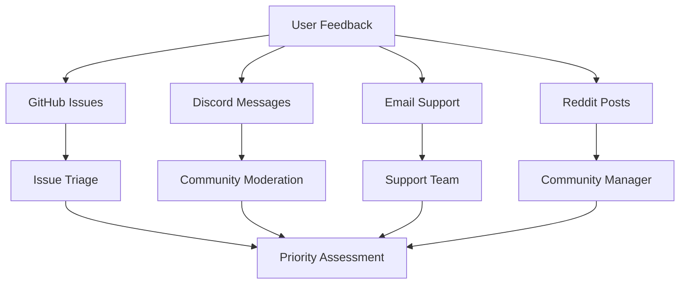

# NanoCap Community Feedback Integration

## Community Engagement Strategy

NanoCap's success depends on active community participation and feedback. This document outlines our comprehensive approach to community engagement and feedback integration.

### 🎯 Community Goals

1. **User-Centric Development:** Build features based on real user needs
2. **Quality Improvement:** Leverage community for testing and bug reporting
3. **Knowledge Sharing:** Create a learning community around video compression
4. **Open Source Collaboration:** Encourage contributions from developers
5. **Long-term Sustainability:** Build a self-sustaining community

### 📊 Feedback Collection Methods

#### Primary Channels
- **GitHub Issues:** Bug reports, feature requests, discussions
- **GitHub Discussions:** Community conversations and Q&A
- **Discord Server:** Real-time communication and support
- **Reddit Community:** Broader community engagement
- **Email Support:** Direct user support and feedback

#### Feedback Types
- **Bug Reports:** Technical issues and errors
- **Feature Requests:** New functionality suggestions
- **Performance Feedback:** System impact and optimization
- **User Experience:** UI/UX improvements and usability
- **Documentation:** Help content and tutorials

### 🔄 Feedback Processing Workflow

#### 1. Collection Phase


#### 2. Processing Phase
- **Triage:** Categorize and prioritize feedback
- **Validation:** Verify issues and assess feasibility
- **Planning:** Integrate into development roadmap
- **Communication:** Keep community informed of progress

#### 3. Implementation Phase
- **Development:** Implement requested features/fixes
- **Testing:** Community beta testing
- **Documentation:** Update guides and help content
- **Release:** Deploy updates with changelog

### 📈 Feedback Analytics

#### Metrics Tracking
- **Response Time:** Average time to respond to feedback
- **Resolution Rate:** Percentage of feedback addressed
- **User Satisfaction:** Feedback quality scores
- **Community Growth:** Active participants and contributors
- **Feature Adoption:** Usage of community-requested features

#### Dashboard Metrics
```javascript
const feedbackMetrics = {
  totalFeedback: 0,
  resolvedFeedback: 0,
  averageResponseTime: 0,
  communitySatisfaction: 0,
  activeContributors: 0,
  featureRequests: 0,
  bugReports: 0,
  performanceIssues: 0
};
```

### 🎨 Community-Driven Features

#### Feature Request Process
1. **Submission:** User submits feature request via GitHub
2. **Discussion:** Community discusses and votes on feature
3. **Assessment:** Development team evaluates feasibility
4. **Planning:** Feature added to roadmap if approved
5. **Development:** Feature developed with community input
6. **Testing:** Community beta tests new feature
7. **Release:** Feature released with community credits

#### Community Voting System
- **GitHub Reactions:** Thumbs up/down on issues
- **Polls:** Discord polls for feature prioritization
- **Surveys:** Regular community surveys
- **Feedback Forms:** Structured feedback collection

### 🤝 Community Roles

#### Core Team
- **Project Maintainer:** Overall project direction
- **Lead Developer:** Technical implementation
- **Community Manager:** Community engagement
- **Documentation Lead:** Help content and guides

#### Community Contributors
- **Beta Testers:** Testing and feedback
- **Bug Reporters:** Issue identification and reporting
- **Feature Requesters:** New functionality suggestions
- **Documentation Contributors:** Help content improvements
- **Code Contributors:** Development contributions

#### Community Moderators
- **Discord Moderators:** Real-time community management
- **GitHub Moderators:** Issue and discussion management
- **Reddit Moderators:** Broader community engagement
- **Support Volunteers:** User assistance and guidance

### 📚 Knowledge Sharing

#### Educational Content
- **Video Compression Guide:** Understanding codecs and compression
- **Screen Recording Best Practices:** Tips for optimal recordings
- **Browser Extension Development:** Technical insights
- **Performance Optimization:** System tuning and optimization

#### Community Resources
- **FAQ Database:** Frequently asked questions
- **Troubleshooting Guide:** Common issues and solutions
- **Video Tutorials:** Step-by-step guides
- **Best Practices:** Community-developed guidelines

### 🔧 Technical Integration

#### GitHub Integration
```yaml
# GitHub Actions for automated feedback processing
name: Community Feedback Processing
on:
  issues:
    types: [opened, labeled, closed]
  pull_request:
    types: [opened, closed]

jobs:
  process-feedback:
    runs-on: ubuntu-latest
    steps:
      - name: Analyze Issue
        uses: ./.github/actions/analyze-feedback
      - name: Update Metrics
        uses: ./.github/actions/update-metrics
      - name: Notify Team
        uses: ./.github/actions/notify-team
```

#### Discord Bot Integration
```javascript
// Discord bot for community management
const discordBot = {
  commands: {
    '!feedback': 'Submit feedback to GitHub',
    '!status': 'Check current development status',
    '!help': 'Get help with NanoCap',
    '!vote': 'Vote on feature requests'
  },
  
  automations: {
    githubSync: 'Sync GitHub issues with Discord',
    metricsUpdate: 'Update community metrics',
    notificationSystem: 'Notify users of updates'
  }
};
```

### 📊 Community Health Monitoring

#### Health Indicators
- **Activity Level:** Daily/weekly active users
- **Engagement Quality:** Depth of discussions and contributions
- **Response Rate:** Community responsiveness to questions
- **Growth Rate:** New member acquisition
- **Retention Rate:** Long-term community participation

#### Warning Signs
- **Declining Activity:** Reduced community participation
- **Poor Response Quality:** Low-quality feedback and discussions
- **High Churn Rate:** Users leaving the community
- **Negative Sentiment:** Increasing complaints and dissatisfaction
- **Technical Issues:** Recurring problems and bugs

### 🎯 Community Incentives

#### Recognition Programs
- **Contributor Badges:** Special recognition for active contributors
- **Release Credits:** Listed in release notes for significant contributions
- **Early Access:** Priority access to new features and beta versions
- **Direct Communication:** Direct line to development team

#### Gamification Elements
- **Points System:** Earn points for contributions and feedback
- **Achievement Badges:** Unlock badges for different activities
- **Leaderboards:** Top contributors and most helpful members
- **Challenges:** Community challenges and competitions

### 📅 Community Events

#### Regular Events
- **Weekly Community Calls:** Live Q&A and updates
- **Monthly Feature Reviews:** Community feedback on new features
- **Quarterly Roadmap Updates:** Development roadmap discussions
- **Annual Community Summit:** Major community gathering

#### Special Events
- **Hackathons:** Community development competitions
- **Beta Testing Campaigns:** Focused testing periods
- **Documentation Sprints:** Community documentation improvements
- **Bug Bash Events:** Intensive bug hunting sessions

### 🔄 Feedback Loop Closure

#### Communication Strategy
- **Regular Updates:** Weekly development updates
- **Feature Announcements:** New feature previews and releases
- **Bug Fix Notifications:** Updates on resolved issues
- **Community Highlights:** Showcase community contributions

#### Success Stories
- **User Testimonials:** Real user success stories
- **Case Studies:** Detailed usage scenarios and benefits
- **Before/After Comparisons:** File size and quality improvements
- **Community Spotlights:** Highlighting active contributors

### 📈 Long-term Community Strategy

#### Growth Plan
- **Year 1:** Build core community and establish processes
- **Year 2:** Expand community and increase contributions
- **Year 3:** Self-sustaining community with active leadership
- **Year 4+:** Community-driven development and innovation

#### Sustainability
- **Community Leadership:** Develop community leaders and moderators
- **Knowledge Transfer:** Ensure knowledge is shared and documented
- **Process Documentation:** Maintain clear processes and guidelines
- **Succession Planning:** Prepare for leadership transitions

---

## Community Guidelines

### Code of Conduct
- **Respect:** Treat all community members with respect
- **Inclusivity:** Welcome diverse perspectives and backgrounds
- **Collaboration:** Work together constructively
- **Learning:** Share knowledge and help others learn
- **Professionalism:** Maintain professional communication

### Contribution Guidelines
- **Quality:** Provide high-quality feedback and contributions
- **Clarity:** Be clear and specific in communications
- **Relevance:** Keep discussions relevant to NanoCap
- **Constructiveness:** Provide constructive feedback and suggestions
- **Documentation:** Document your contributions clearly

### Moderation Policy
- **Warning System:** Progressive warnings for violations
- **Temporary Restrictions:** Short-term restrictions for repeated violations
- **Permanent Bans:** Permanent bans for severe violations
- **Appeal Process:** Clear process for appealing moderation decisions

---

**Join the NanoCap community and help shape the future of efficient screen recording!**
